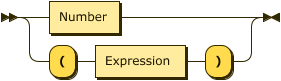

用 Rust 实现整数的带括号四则运算：

四则运算的 EBNF 定义如下：
``` ebnf
Expression ::= (Expression [+-])? PriorityExpression
PriorityExpression ::= (PriorityExpression [*/])? Factor
Factor ::= Number | "(" Expression ")"
```
消除左递归，转化为 LL(1) 文法：
``` ebnf
Expression ::= PriorityExpression ExpressionTail
ExpressionTail ::= ([+-] PriorityExpression ExpressionTail)?
PriorityExpression ::= PriorityExpression PriorityExpressionTail
PriorityExpressionTail ::= ([*/] Factor PriorityExpressionTail)?
Factor ::= Number | "(" Expression ")"
```
Railroad Diagram 如下：
### Expression:

### PriorityExpression:

### Factor:


相关 Railroad Diagram 在这个网站生成 https://www.bottlecaps.de/rr/ui